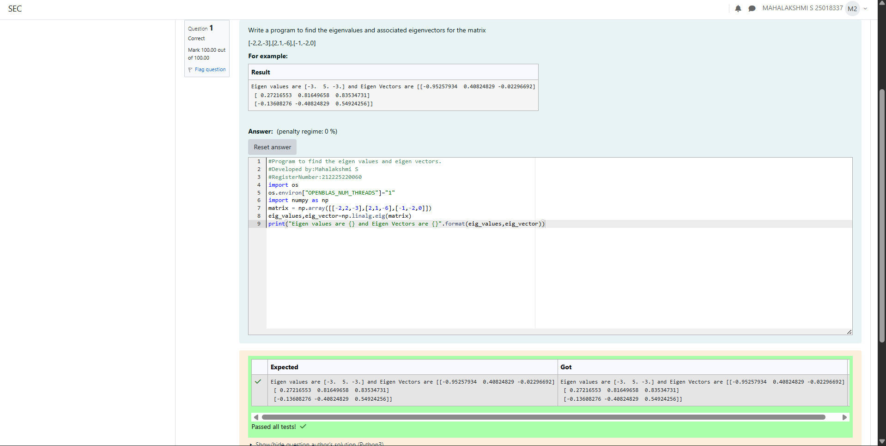

# EIGENVALUES-AND-EIGENVECTORS
## Aim:
To write a python program to find the Eigenvalues and Eigen Vectors
## Equipment’s required:
1. 	Hardware – PCs
2. 	Anaconda – Python 3.7 Installation / Moodle-Code Runner
## Algorithm:
### Step1 :Import the NumPy library.
### Step 2:Define the given matrix using NumPy array. 
### Step 3: Using the np.linalg.eig(),  we get two results (first is eigenvalue and second is eigenvector) of the given matrix.
### Step 4: Display the eigenvalues and eigenvectors.

## Program:
```
#Program to find the eigen values and eigen vectors.
#Developed by:Mahalakshmi S
#RegisterNumber:212225220060
import os
os.environ["OPENBLAS_NUM_THREADS"]="1"
import numpy as np
matrix = np.array([[-2,2,-3],[2,1,-6],[-1,-2,0]])
eig_values,eig_vector=np.linalg.eig(matrix)
print("Eigen values are {} and Eigen Vectors are {}".format(eig_values,eig_vector))

```

## Output:


## Result:
Thus the Eigenvalue and Eigenvector is successfully solved using python program
